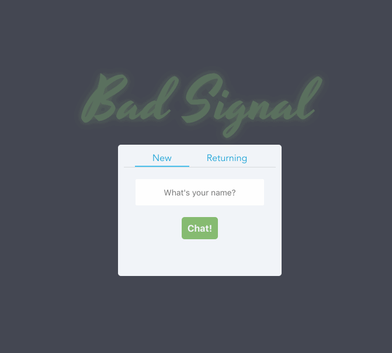

# Bad Signal
_A surprisingly accurate chat app._

## Stack Used
Built on a MEVN stack _(Mongo, Express, Vue, Node)_. _Socket.io_ handles the sockets. On the front end, _Axios_ makes the HTTP Requests easier, and _SCSS_ helps out with the styling.

## To Run

First, you'll need MongoDB installed and running. [These guys](https://docs.mongodb.com/manual/installation/) seemed to know what they're talkin' about.

To start the node server, head to the server directory (`cd server/`) and run an `npm install`. Next, you have two options. 
`npm run start` will start the server normally. `npm run dev` will start with nodemon, and will pick up any changes you may make to the code.

Once the server is started, open another terminal window and head to the client directory (`cd client/bad-signal`). After an `npm install`, `npm run serve` should do to the trick.

Now, head to `http://localhost:8080` and start chatting!
